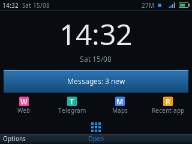
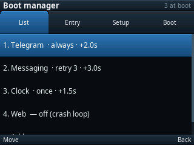
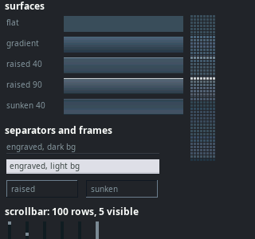
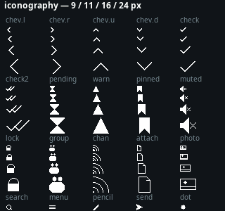
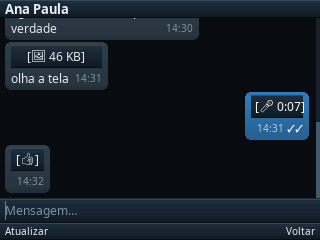
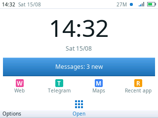
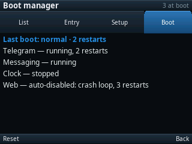

# epoc — a Rust SDK for Symbian S60 3rd Edition

**Write applications in Rust for a 2009 Nokia. They run on the phone.**

Not an emulator and not a toy: the binaries below are installed on a Nokia E72 and
running on its own ARM11, drawn by a rasterizer written here, talking over its radio.

| | | |
|:---:|:---:|:---:|
|  |  |  |
| A Telegram client | A home screen | A boot manager |

    Target   Nokia E72 — Symbian OS 9.3, S60 3rd Ed FP2, ARM1136JF-S at 600 MHz,
             320x240 landscape QVGA, hardware QWERTY, no touchscreen, ~45 MB free RAM
    Host     aarch64 Linux. No Wine, no x86 emulation, no Windows, anywhere in the chain

EPOC is what this operating system was called before it was called Symbian.

## How it works

Avkon — Symbian's UI framework — calls `CActiveScheduler::Start()` and does not return
until the app exits. There is no loop for Rust to own and no way to take one. So control
is inverted:

    your app  ──►  a struct with handle_key() and draw(), like a winit handler
                        ▲                    │
                        │ events             │ pixels
                        │                    ▼
    symbian-*     ──►  safe Rust: files, sockets, widgets, a rasterizer, crypto
                        ▲                    │
                        │                    ▼
    shim/         ──►  C++: owns the app object, turns every keypress and I/O
                        ▲                completion into plain data on a ring buffer
                        │                    │
                        ▼                    ▼
    the phone     ──►  Avkon, ESock, the file server, the message store

Everything that can *Leave* — Symbian's error mechanism, which on 9.x is a C++ throw —
stays on the C++ side of that boundary, because a throw crossing a Rust frame compiled
`panic=abort` skips every destructor. Everything above it is ordinary safe Rust, and
almost all of it runs on the host too, which is why there are 685 tests and no phone in
the loop.

There is no platform UI in any of that. Every pixel — the surfaces, the icons, the
scrollbars, the fonts — is rasterized by `symbian-gfx` and `symbian-ui`, because Avkon's
own widgets cannot be driven from Rust without dragging its class hierarchy across the
boundary. `epoc preview` renders the whole design system to PNG without a phone:

| | |
|:---:|:---:|
|  |  |

[`docs/architecture.md`](docs/architecture.md) has the long version.

## Projects

Full applications built on this SDK. Each lives in its own repository and pins this one
by revision.

<table>
<tr>
<td width="33%" valign="top">

### [tg](https://github.com/pizzaria-foundation/tg)

**A Telegram client.** MTProto 2.0 written from scratch — the login exchange, the
chat list, conversations, photo and voice messages. The reference application, and
the reason this SDK exists.

</td>
<td width="33%" valign="top">

### [home](https://github.com/pizzaria-foundation/home)

**A home screen.** An app grid, a status bar, configurable shortcuts, hardware-button
remapping, and two daemons behind it. Runs resident, alongside the platform's own idle
rather than replacing it.

</td>
<td width="33%" valign="top">

### boot manager

**Boot order and restart policy** — neither of which S60 has. The codec and the screens are here
(`crates/symbian-bootcfg`, `crates/symbian-bootctl`); the two binaries moved to the home repo,
where the system they supervise lives.

</td>
</tr>
</table>

Built something? Open a pull request adding it here. What the list is for is proving
the SDK works for more than one program.

## Status

Confirmed on hardware: a Rust chat client runs on the E72, draws through its own
rasterizer, takes input from the full QWERTY, and talks to Telegram over TCP.

Also confirmed, in one install by `apps/devdump` — the report is `docs/device-dump.txt`:
a polymorphic DLL built here loads and its ordinal 1 is callable; the Message Server
opens and reports 15 registered MTMs; all twenty capabilities are granted *and* honoured;
and 283 of the 292 libraries asked about load, Open C among them.

    Toolchain, packaging, install   done    GCC 15.2 + binutils 2.45, arm-none-symbianelf
    Drawing, text, layout           done    symbian-gfx, symbian-ui: RGB565, own atlases
    Input                           done    QWERTY, overlaid keypad, Fn layer, D-pad, softkeys
    Keyboard layouts, accents       done    symbian-keys: ABNT2 from the handset's own keymap
    Timers, clock                   done
    Files, atomic save              done    symbian::fs, in the app's data cage, no capability
    TCP, DNS, bearer selection      done    symbian::net, over ESock
    UDP                             done    used by the dev bridge's discovery beacon
    Crypto                          done    symbian-crypto: SHA-1/256/512, HMAC, AES, IGE,
                                            bignum, PBKDF2, DRBG - none of it from the platform
    Image decode                    done    symbian::image, through the handset's own codecs:
                                            JPEG, PNG, GIF, BMP. Not WebP, which postdates it
    Audio decode                    done    symbian-audio: Ogg/Opus in, playable WAV out
    SQL storage                     built   symbian::sql, over the platform's own SQLite
                                            (sqldb.dll). Not yet run on hardware: whether
                                            the E72 carries the DLL is what examples/sqlprobe
                                            is for. Until that report exists, treat it as
                                            unproven
    Device logging                  done    symbian::log!, switched by DEBUG= in app.conf;
                                            one file per app, read back with `epoc logs`
    Host simulator                  done    symbian-sim: the real app in a window
    Contact sheets                  done    symbian-preview: any screen to a PNG
    Project scaffolding             done    epoc new
    Polymorphic DLLs                done    TARGETTYPE=DLL: edll.lib, own linker script,
                                            exports pinned by app.conf, gated by e32dump
    Device reconnaissance           done    apps/devdump: one .sis, a launcher and ten
                                            isolated probes; the report is docs/device-dump.txt
    Boot order and restart policy   built   crates/symbian-bootcfg + symbian-bootctl: the codec,
                                            the supervisor state machine and the screens. The
                                            platform has neither (STARTUP_ITEM_INFO has no
                                            ordering field and one recovery policy, "do nothing").
                                            The binaries that use them live in the home repo
    Custom MTM registration         done    apps/mtmdemo: a Client MTM the Message Server
                                            accepts. Registry 15 -> 16 on an E72, read from a
                                            fresh session. See docs/device-notes.md
    Message into the native Inbox   done    symbian::msg writes an entry the Messaging app
                                            lists — no MTM needed for delivery
    MTM icon in the native Inbox    done    apps/mtmdemo's UI Data component. Confirmed on an
                                            E72: our bitmap, not the unknown-type envelope,
                                            and deleting works from Nokia's own UI
    Opening a message natively      done    apps/mtmdemo's UI MTM. Confirmed on an E72: the
                                            native Messaging app opens our message with our
                                            viewer, an Avkon dialog drawn inside its process
    Replying natively               done    apps/mtmdemo's UI MTM. Confirmed on an E72: reply
                                            from Nokia's menu, an Avkon query dialog, and the
                                            reply left in the store for a daemon to send
    Any service in the native Inbox  built   crates/symbian-mtm: a two-method trait, and
                                            shim/mtm's C++ base classes. apps/mtmdemo is the
                                            reference subclass and is the thing that ran
    Waking on a store event          unproven a service polls on a timer, which works; whether
                                            a session event crosses a process boundary is what
                                            apps/devdump/probes/msvev exists to measure, and
                                            nothing depends on the answer
    Native new-message notification blocked MNcnNotification kills the caller; the Avkon
                                            classes have no public header in this SDK
    HTTP                            todo    nothing yet; TCP is there to build it on — but the
                                            handset has http.dll, so porting may be unnecessary
    TLS                             todo    nothing yet, and two routes exist on the device:
                                            securesocket.dll, and Open C's OpenSSL 0.9.8a

685 tests, all on the host.

## How to use it

Three commands. The first two need no phone at all:

    tools/epoc new myapp                   scaffold a project that builds and runs
    cargo run -p myapp --example sim       see it on your desktop, right now
    tools/epoc build apps/myapp            -> apps/myapp/build/myapp.sis

One front door for everything:

    epoc new <name> [uid3]        scaffold
    epoc build <app-dir> [clean]  sources -> .sis
    epoc preview                  render the SDK's contact sheets to preview-out/
    epoc serve                    serve out/ over the LAN so the phone can fetch a .sis

`new` and `build` front `tools/symnew` and `tools/symbuild`, which still work when called
directly. `sideload`, `sh`, `rshell`, `logs` and `pull` front ADBian, the remote shell that
runs on the phone — a sibling checkout, not part of this SDK.

### From your own project

The SDK is consumed as a git dependency, pinned by revision:

    [dependencies]
    symbian = { git = "ssh://git@github.com/pizzaria-foundation/epoc", rev = "..." }
    symbian-ui = { git = "ssh://git@github.com/pizzaria-foundation/epoc", rev = "..." }

    [dev-dependencies]
    symbian-sim = { git = "ssh://git@github.com/pizzaria-foundation/epoc", rev = "..." }

SSH rather than HTTPS while this repository is private: an https git dependency to
a private repo fails with "revision not found", which is a permission problem
wearing the wrong hat. Cargo's built-in git client may also fail ssh-agent
authentication where the `git` CLI succeeds, so a consuming project wants:

    # .cargo/config.toml
    [net]
    git-fetch-with-cli = true

The **device build needs a checkout**, not just the crates: the toolchain, the C++
shim and the packaging live here and no crate can carry them. Clone this repository
and run `tools/epoc build <your-app-dir>` from it. See [tg](https://github.com/pizzaria-foundation/tg) for a
working example of both halves, including the `[patch]` block for working on an app and
the SDK at once.

## What is in here

Applications and diagnostics that ship with the SDK. The full programs live in their
own repositories (see [Projects](#projects) above); these are the ones whose job is to
exercise or serve the SDK itself.

    apps/
      devdump      One install, one report. A launcher and ten isolated probes — caps,
                   dll, fs, libsweep, msg, msvev, mtm, ncn, net, system — because each
                   risky import belongs in its own binary, or a silent load failure
                   takes the whole instrument down with it. Output: docs/device-dump.txt
      mtmdemo      A Client MTM the Message Server actually loads, plus the UI Data and
                   UI MTM components: our icon in Nokia's Inbox, our viewer opening our
                   message, reply from Nokia's own menu. Builds a .dll, not a .sis
      iconprobe    The app-icon fetch, isolated in a non-resident app because bisecting it
                   inside a resident home screen kept taking the home screen with it.
                   Resolved on the E72: reading the app's registered icon FILE through
                   AknIconUtils works (right size, real mask, MIF included); the
                   CApaMaskedBitmap route cannot work here. docs/device-notes.md has the
                   measurements and the journal the probe keeps to survive a panic
      killhome     Escape hatch: stop a resident home screen that captures the Menu key
                   and will not close on End
      dlltest      A minimal polymorphic DLL, built to prove the toolchain can

    examples/
      selftest     Everything the SDK can do, run once, written to a file you carry off
      hello-gui    The same app in C++, for comparing against the Rust path
      netprobe     Four network tests, each isolating one unknown
      imgprobe     Which CImageDecoder configuration actually decodes here
      audioprobe   Which WAV formats play, and how fast they open
      sqlprobe     Whether this handset has SQLite, and what it costs
      keyprobe     What the keyboard really sends
      keydump      The handset's own keymap, dumped — the keyboard tables are generated
                   from this rather than guessed
      libprobe     Which libraries load
      probe        The smallest thing that can run, for when nothing else will

Every one of these exists because a question could not be answered from a document.

## The map

    crates/
      symbian-gfx      the rasterizer. no_std, no unsafe, no allocation while drawing
      symbian-ui       widgets and the design system: surfaces, icons, palettes, the viewer
      symbian-keys     physical keyboard layouts and dead-key composition
      symbian-sys      the raw FFI boundary, mirroring shim/inc/symbian_shim.h
      symbian          safe wrappers: files, sockets, images, SQL, the disk cache, the log
      symbian-app      the device entry points as one macro
      symbian-audio    Ogg/Opus in, playable RIFF/WAVE out - codecs the handset lacks
      symbian-crypto   hashes and ciphers the platform does not ship
      symbian-preview  host-side contact sheets: any screen to a PNG
      symbian-sim      the host simulator, generic over any App
      opus             the vendored libopus, and the only unsafe in the audio path

    shim/              the C++ side: everything that can Leave, and the event pump
    tools/             epoc (new, build, preview, sideload, logs, serve), and the pieces
                       behind it: symbuild, symnew, mkfont, mkkeymap, e32dump, e32prep,
                       sisdump, sisextract, btrecv
    apps/              what ships with the SDK: devdump, mtmdemo, bootctl/bootd, and probes
    examples/          device diagnostics and the C++ comparison — see "What is in here"
    docs/              start with getting-started.md

Each crate has its own README with the decisions behind it.

## Where to read next

| | |
|---|---|
| [getting-started.md](docs/getting-started.md) | prerequisites, the toolchain, your first app |
| [architecture.md](docs/architecture.md) | why there is a C++ shim, and what crosses the boundary |
| [device-notes.md](docs/device-notes.md) | everything the hardware taught us that no document says |
| [build-flow.md](docs/build-flow.md) | the pipeline, stage by stage |
| [launcher.md](docs/launcher.md) | the platform side of a home screen: startup resource, resident mode |
| [device-dump.txt](docs/device-dump.txt) | the raw report one install of `apps/devdump` brought back |

`docs/device-notes.md` is the one to read if you are deciding whether to trust any of
this. It is a log of assumptions that turned out wrong.

## The name is not ours

EPOC and Symbian are somebody else's names, and both appear all over this repository.

EPOC was Psion's, and became Symbian OS. Symbian was Symbian Ltd's, then Nokia's, and the
trademark sits with Accenture today. Neither name belongs to this project and neither is
claimed by it.

That covers the project name `epoc`, and it covers **the `symbian-` prefix on every crate
here**: `symbian`, `symbian-gfx`, `symbian-ui`, `symbian-sys`, `symbian-app`,
`symbian-keys`, `symbian-audio`, `symbian-crypto`, `symbian-preview`, `symbian-sim`. Those
names are descriptive - each one says which platform the crate targets and nothing more.
None of them is published to crates.io, none implies endorsement by or affiliation with any
rights holder, and if one of them would rather we did not use the word, we will rename.
Renaming is a `sed` and a revision bump; the code does not care what it is called.

Nokia's S60 SDK, the platform headers and the import libraries are not redistributed
here; `docs/getting-started.md` says how to obtain them. Same for the built toolchain and
the third-party research material - `.gitignore` lists what is excluded and why.

## How this was written

With AI assistance, throughout. Claude wrote and reviewed a large share of this code and
most of these comments, and the commit trailers say so rather than hiding it.

It was still made with care, and the way to check that is not to take our word for it:

- Every claim about the hardware was **measured, not reasoned about**.
  `docs/device-notes.md` is a log of assumptions that turned out wrong, and the probes in
  `examples/` exist because guessing cost us device round trips. The keyboard tables are
  generated from a dump of the handset's own keymap for exactly this reason.
- The comments say **why**, not what. Where a decision looks strange, the comment names
  the failure that produced it - a truncating append, a socket that panics esock, a
  contact sheet that lied about its own pixels.
- **685 tests, all on the host**, because the interesting bugs are in loops and edge cases
  and a phone is a terrible place to find them.
- Nothing here is claimed to work that has not run on a real E72.

Neither the assistance nor the care is a substitute for review. Read the code.

## Licence

MIT. See `LICENSE`.
